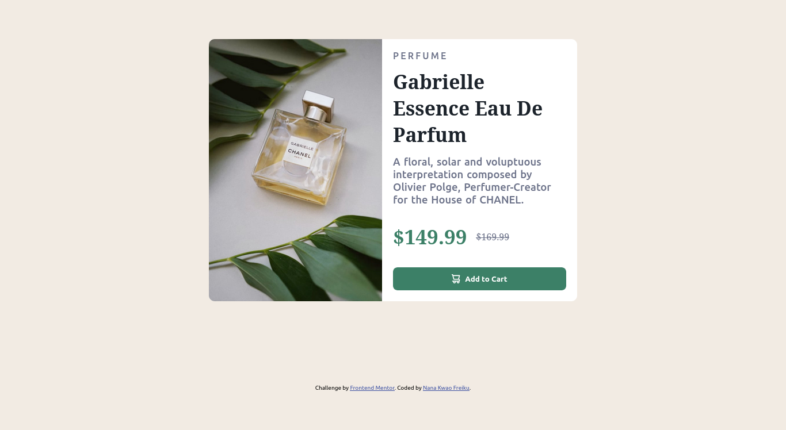
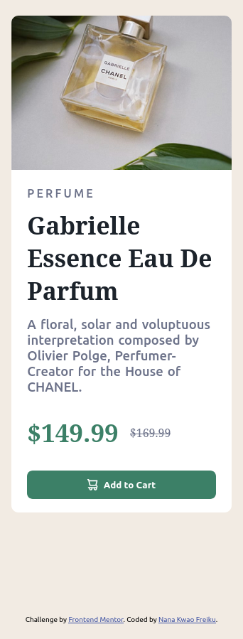

# Frontend Mentor - Product preview card component solution

This is a solution to the [Product preview card component challenge on Frontend Mentor](https://www.frontendmentor.io/challenges/product-preview-card-component-GO7UmttRfa). Frontend Mentor challenges help you improve your coding skills by building realistic projects.

## Overview

This project is a solution to the Product preview card component challenge from Frontend Mentor. The goal was to create a visually appealing product card using only HTML and CSS. The component displays a product image, title, description, price, and an "Add to Cart" button, all styled for clarity and modern aesthetics.

The project focuses on semantic HTML structure, responsive design using Flexbox, and custom styling with CSS variables and custom fonts. The page is fully responsive and adapts well to different screen sizes, making it suitable for both desktop and mobile devices.

### Screenshot




### Links

- Solution URL: [https://github.com/nana-kwao/product-preview-card-challenge](https://github.com/nana-kwao/product-preview-card-challenge)
- Live Site URL: [https://nana-kwao.github.io/product-preview-card-challenge](https://nana-kwao.github.io/product-preview-card-challenge)

## Built with

- Semantic HTML5 markup
- CSS custom properties
- Flexbox
- Mobile-first workflow

## What I learned

While working on this project, I strengthened my understanding of semantic HTML and responsive design using Flexbox. I learned how to structure a product card with clear sections, use custom fonts for improved aesthetics, and apply CSS variables for consistent theming. I also practiced making the layout adapt well to different screen sizes.

Here are some code snippets that highlight what I learned:

```html
<section>
  <h3>Perfume</h3>
  <h1>Gabrielle Essence Eau De Parfum</h1>
  <p class="para">
    A floral, solar and voluptuous interpretation composed by Olivier Polge,
    Perfumer-Creator for the House of CHANEL.
  </p>
  <p class="price">
    <span class="actual">$149.99</span>
    <span class="discount">$169.99</span>
  </p>
  <button type="button">
    Add to Cart
  </button>
</section>
```

```css
main {
  width: 100%;
  display: flex;
  flex-direction: column;
  border-radius: 0.623rem;
  background-color: var(--white);
}
.price .actual {
  color: var(--green500);
  font-size: 2.2rem;
  font-weight: bolder;
}
```

## Author

- Frontend Mentor - [@nana-kwao](https://www.frontendmentor.io/profile/nana-kwao)
- Twitter - [@f_nanakwao](https://www.twitter.com/f_nanakwao)

## Acknowledgments

Thanks to the Frontend Mentor community for inspiration and assistance. Special thanks to those who provided feedback on my solution.
